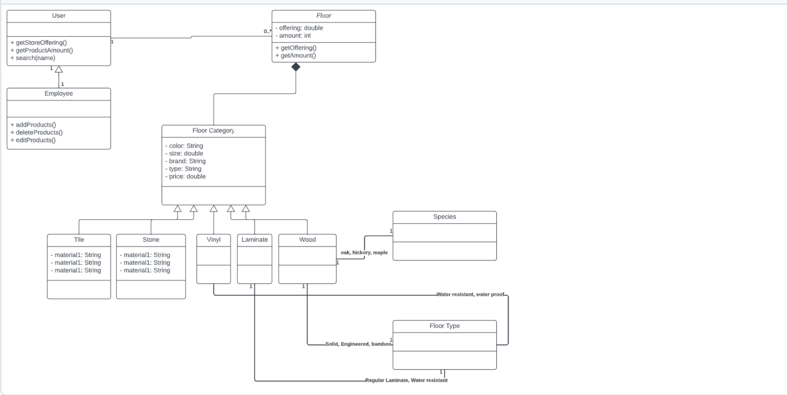
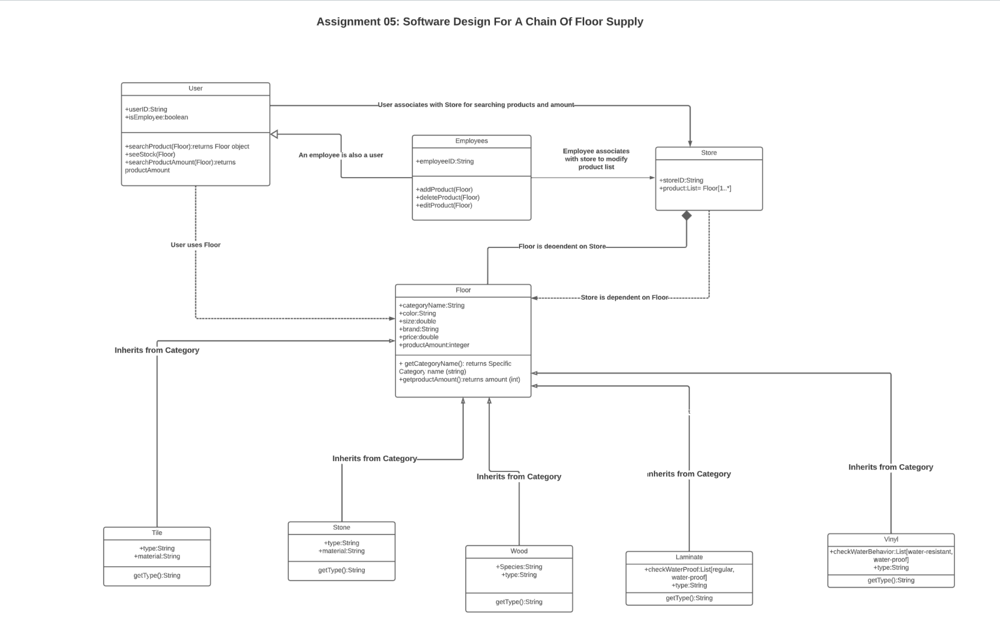
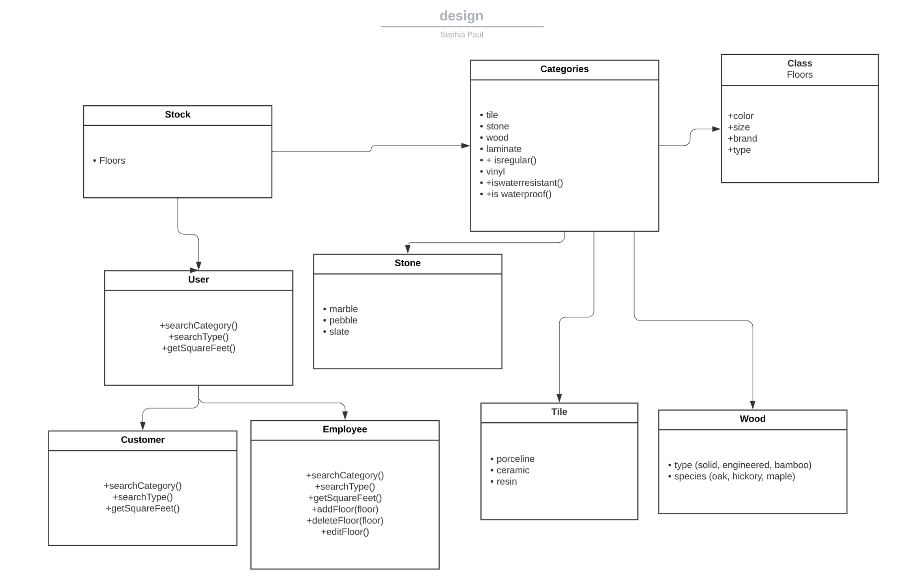
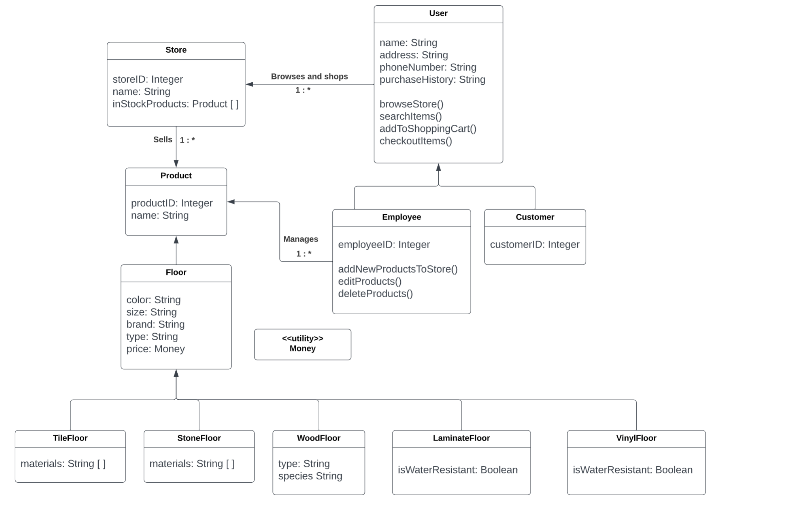
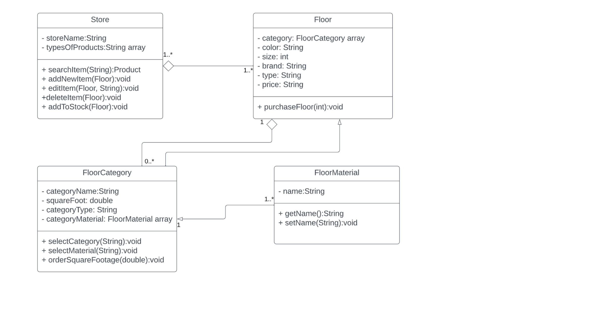
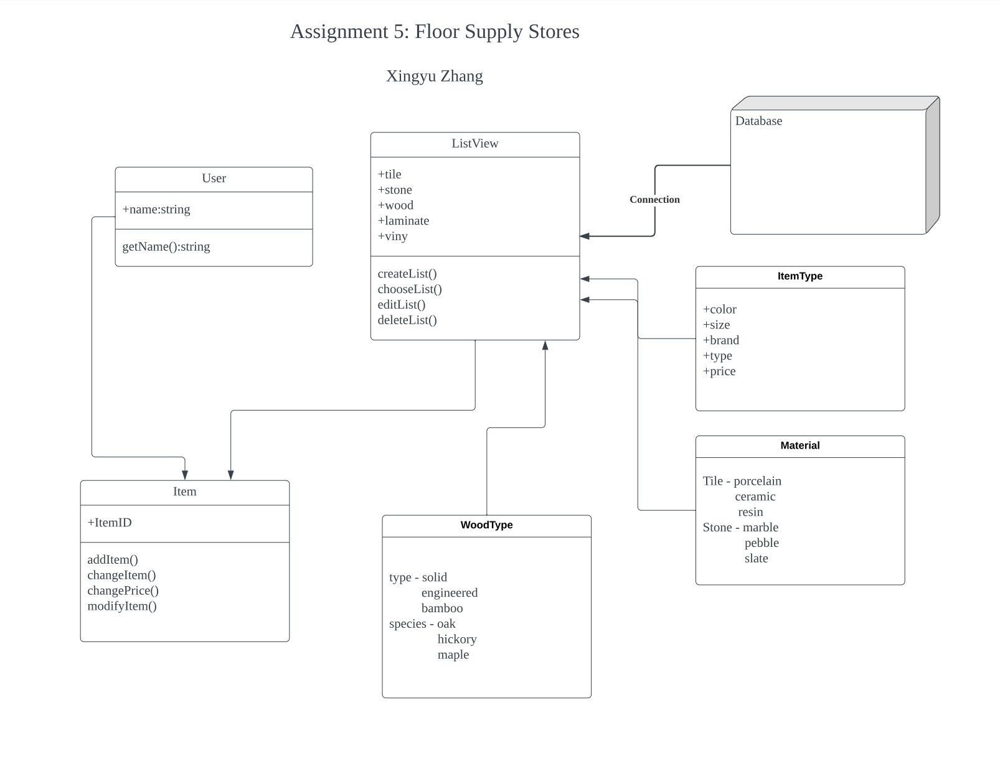
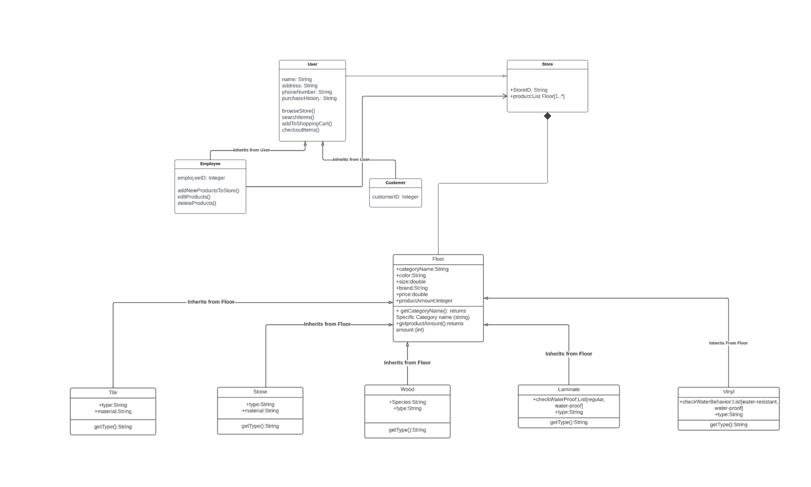

# Design Discussion

### Design 1 - Ameer Syed (AmeerSyed7340)         

        

   

Pros:      
1. I implemented a User class with Employee class as a child because that way a customer child class is unable to add, delete or edit products.
2. The floor category class has an aggregation with floor which makes sure that the categories cannot exist without initially creating a floor class.
3. The Tile and Stone classes have their own materials as string attributes which makes them un-editable while letting the user see them.  

Cons:
1. The species and floor type go directly into wood and laminate categories which restricts them to only those two categories. If we ever at any point need to assign new types then its not possible.
2. It is missing a customer child class which doesn't let it create a customer.

### Design 2 - Mehruj Kamal (Mehruj)      

       

      

Pros:      
1. Implements basic design for the a chain of Floor Supply Stores. All the necessary classes, attributes and operations are present. 
2. Contains details about the relations between the classes.

Cons:     
1. No subclass for regular customers.
  
### Design 3 - Sophia Paul (Sophiap16)

         

   

Pros:      
1. The necessary attributes for the floors are present
2. Customer and Employee have methods to search through the inventory    

Cons:
1. The relationships between the classes are not properly portrayed
2. There are not enough attributes that express what User/Employee/Customer is 
3. The data types of the attributes is not expressed 
4. Could be more concise 

### Design 4 - Gabriel Zhen (gabzn)       

       

      

Pros:      
1. Uses User as an abstract class. Both Employee and Customer can inherit from the abstract class and obtain all the shared attributes.
2. Uses Floor as a super class. Different floor categoties can inherit from the super class and obtain all the shared attributes.
3. Displays clear relationships between entities and classes.  

Cons:     
1. Product class seems to be extra or unnecessary as we are only looking at the floors sold in this store.

### Design 5 -Hammad Chaudhry (hchaudhry98)      

       

      

Pros: 
1. Implements basic design for a floor display system 
2. Contains most of requirements for this system

Cons: 
1. Does not display accurate relationships between classes 
2. Missing a few attributes and/or methods
3. Missing classes and/or subclasses for User, Employee, and Customer

### Design 6 -Xingyu Zhang (zxy9889)      

       

      

Pros:      
1. All atrributes, classes and basic requirements are present.              

Cons:     
1. Database is not required for the design phase.
2. Missing other floor categories.

### Team Design        

       

      

Commonalities between all individual designs     
1. Similar classes and attributes were found in all of our designs.     
2. Similar methods were also found throughout all of our designs     
3. All designs followed the basic structure to some degree     

Differences between Team design and Individual design:     
1. A more organized and more efficient design than the individual designs.     
2. Includes all classes that were missing from the individual designs.     
3. Excluded unnecessary classes and attributes.     
4. Decisions were made to include the more detailed attributes and classes from our individual designs.      

### Summary       

Whilst working on the project, we found that communicating on others' designs and critiquing them with an open mind led to a more efficient design. We also learnt a lot more about the UML class designs in regards to the relationships between the classes. As a team, we also came to decisions much faster on the attributes and methods to add for each of the classes because of our critiquing and our willingness to learn from one another. 
