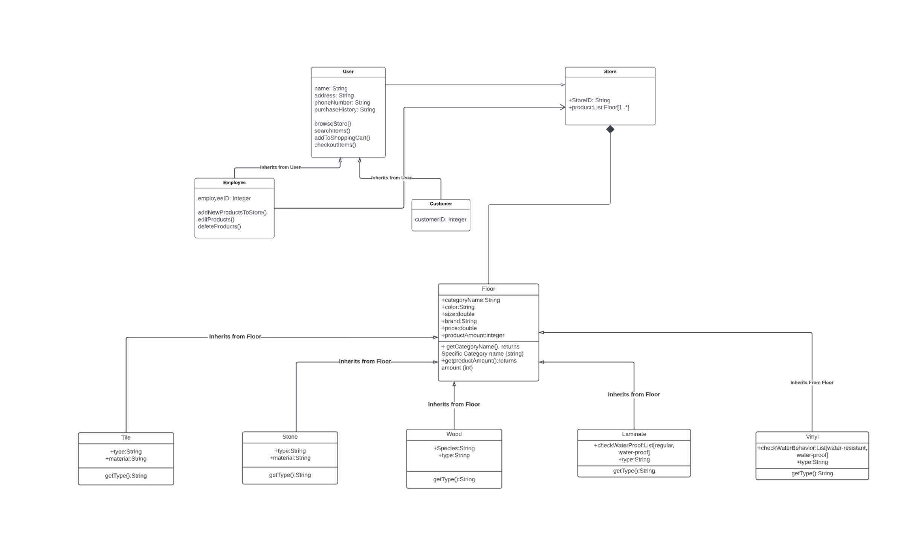

# Design Document

**Author**: Team 03

## 1 Design Considerations

### 1.1 Assumptions

We will be using Android Studio as our operational environment. Some dependencies will include database driver and log-in authorization. Database driver will be used to perform CRUD operation from the database. Log-in authorization might be used to help develop the login activity. Design constraints using the Layout view is itself a challenge to find what works when displaying multiple products.

### 1.2 Constraints

- Customer cannot order more than what is available.
- Customer cannot adjust attributes.
- Customer can't add or delete floors.

### 1.3 System Environment

- The app will be for mobile devices and will implement Android OS.
- The android must be at least API level 21 or higher.

## 2 Architectural Design

### 2.1 Component Diagram

### 2.2 Deployment Diagram

## 3 Low-Level Design

### 3.1 Class Diagram

### 3.2 Other Diagrams

## 4 User Interface Design

