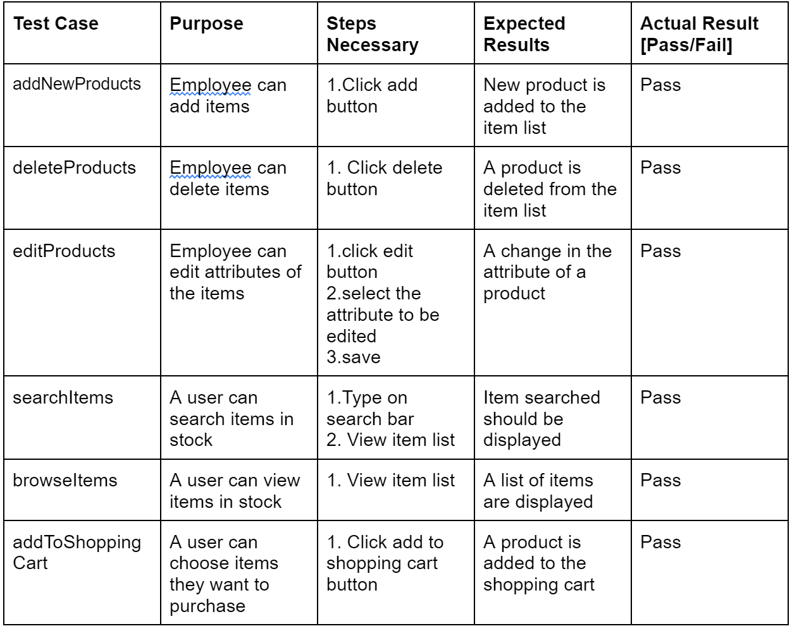

# Test Plan

**Author**: Team 03

## 1 Testing Strategy

### 1.1 Overall strategy

When it comes to testing for this application, we have collectively decided that we will implement integration testing, system testing, regression testing to ensure that the application is in working order. As more functionalities are implemented, our back-end team will work on the regression testing to ensure that all features work as they should as functionalities are added to the app. Our entire team will work together to implement system testing to ensure the complete functionality of our application.

### 1.2 Test Selection

So the method in which we will select our test cases is that we will select those methods/buttons that require some type of back-end functionality. We will select our test cases by prioritizing the cases that query the database for information, to ensure that the database remains accurate throughout the duration of the construction phase. We will implement white-box techniques in order to make sure our code contains no faults and/or failures. 

### 1.3 Adequacy Criterion

The main goal of our test cases will be to properly achieve the highest percentage of statement coverage. This is our main purpose to make sure the application runs properly and given the different situations if it exists.

### 1.4 Bug Tracking

Unit Testing: we will be testing each activity one at a time to minimize the likelihood of regression errors.

### 1.5 Technology
We will use a manual test case. In future we will test with JUnit Testing.

## 2 Test Cases

