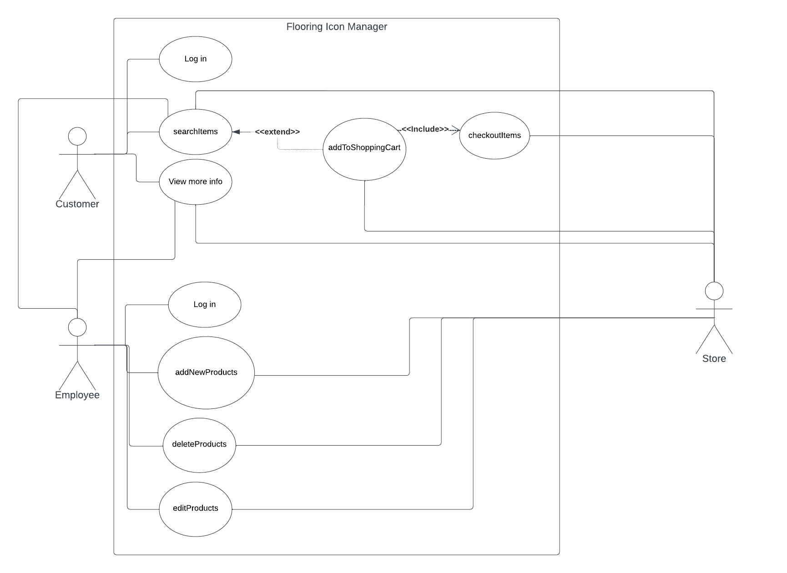

# Use Case Model

**Author**: Team 03

## 1 Use Case Diagram

## 2 Use Case Descriptions

Requirements: Both Employees and Users must be able to log in to perform any operation. Users must be able to search for a product, click on a specific product to see more information and add products to the shopping cart. The customer can also checkout after the products have been added to the shopping cart. Employees must be able to add, edit and delete products in the store.

Log in:

- Requirements: Both Employees and Users must be able to log in to perform any operation.
- Pre-conditions: Users must have a pre-existing account
- Post-Conditions: Users(Customer) should be able to add items to cart and check out items. Users(Employees) should be able to add, delete and edit items. 
- Scenarios: 
A user logs in to buy a product
A user may log in only to browse the store but decide not to buy at that moment
A user might just add items to the cart and save it for later before logging out

SearchItems:

- Requirements:A user can search items from the store. 
- Pre-conditions: The product the customer is searching for must exist. There must be a search feature, for example: search bar
- Post-conditions: The item user is searching for should get displayed
- Scenarios: 
The item should get displayed if the user put the exact name on the search feature
If the user input is not an exact match, after searching, a product with similar description should get displayed
In case the item user is trying to search does not exist, no items are displayed

View More Info:

- Requirements: The product the customer is looking for must exist
- Pre-conditions: The customer must select the item
- Post-conditions: A description of the item will appear below
- Scenarios: 
A customer searches for floors and selects on they're interested in
Once they select, they are brought to a page designated for that particular floor 
There should be a link labeled "View more info"  that will expand a dialog box when clicked 

AddToShoppingCart:

- Requirements: The customer clicks on an add to cart button.
- Pre-conditions: The customer must find a product first.
- Post-conditions: The product is added to the shopping cart.
- Scenarios: 
One product is added to the cart successfully.
The product could be out of stock and thus not added to the cart.

CheckOutItems:

- Requirements: There must be products in the shopping cart for the user to check out.
- Pre-conditions: Customers must add products to the shopping cart.
- Post-conditions: Customers check out the products and the shopping cart is clear. The stock for each product should be reduced by a certain amount.
- Scenarios:
Customers pay and check out items in the cart.
Customers might want to add other products before checking out.
Customers no longer want to purchase any product.

AddNewProductsToStore:

- Requirements: The user will add products to the store
- Pre-conditions: The user must be logged in as an employee
- Post-conditions: The stock of the product increases 
- Scenarios:
There should be a "add products" button that the employee will click. Once clicked , they will be able to fill out the attributes such as brand, color, type, species, quantity, etc.

DeleteProducts:

- Requirements: This attribute allows the user to delete the item from the list of available items in stock.
- Pre-conditions: The user must be an employee in order to access this attribute. 
- Post-conditions: The list of items will update for both types of users.
- Scenarios:
The employee has decided to remove an item from the store.
Some products might have been seasonal and the employee has decided to remove the product after the time has expired.
There might have been an emergency where the app showed an unavailable product as available and the employee had to remove the item.

EditProducts:

- Requirements: The User will change some attributes of the floor
- Pre-conditions: The user must be logged in as an employee
- Post-conditions: The pre-existing attributes of a particular floor will be changed
- Scenarios:
The store receives a large shipment of a particular type of floor and an employee will have to update the database to reflect the shipment
An employee realizes that one type of floor has an attribute that is listed incorrectly and must go in and change it
