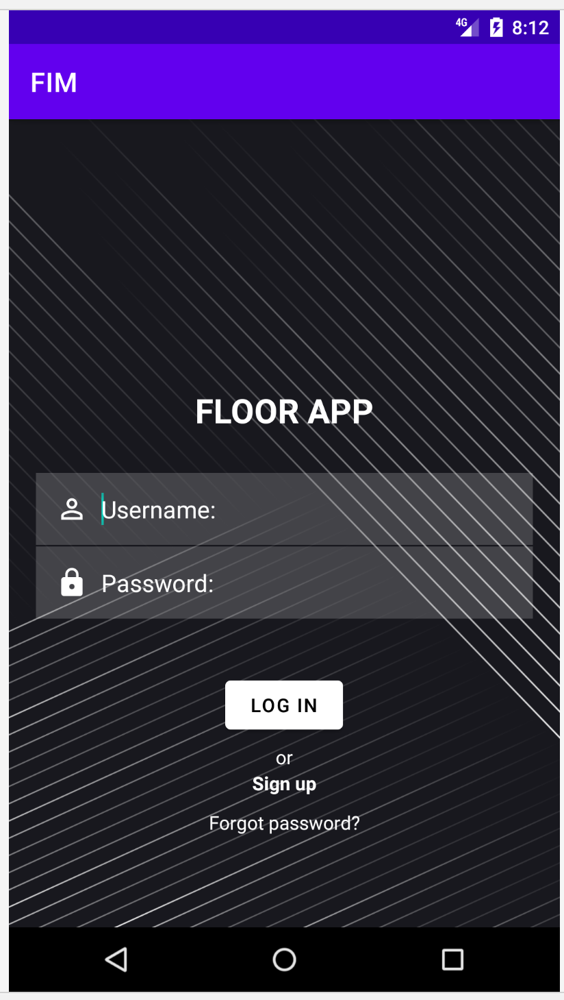
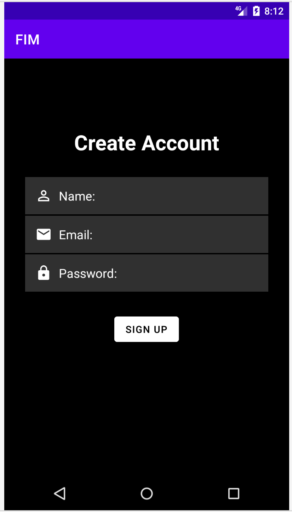
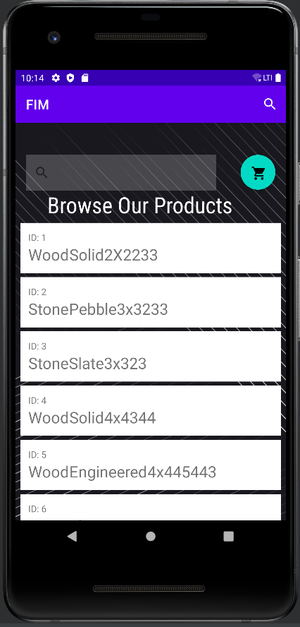
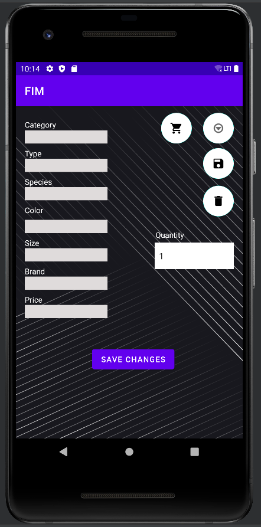
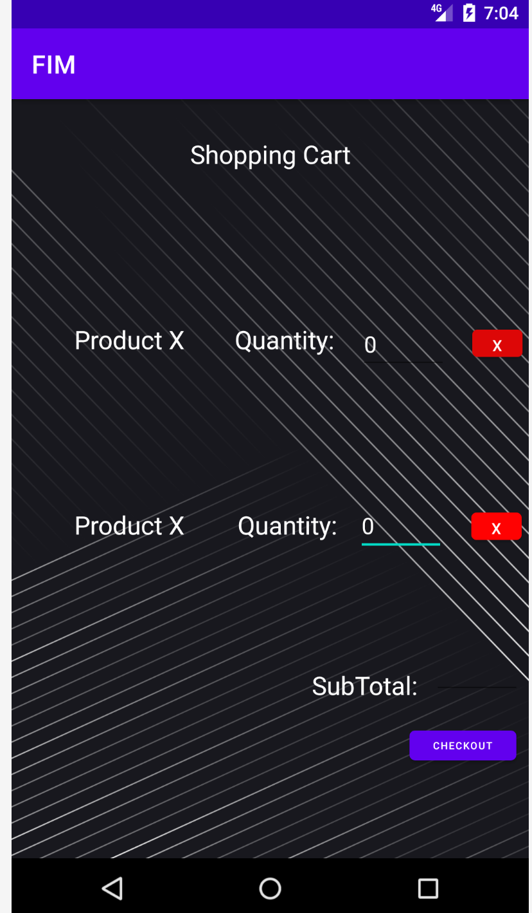

# User Manual

### Login/Signup

- This is an android app,  FlooringIconManager  for Flooring Icon Inc. who is in need of a better way to keep track of their inventory across all stores.
- There are two types of users for this app. Regular users, or customers and employees. 
- The regular customers can sign up for an account or view the app as a guest. 
- On the other hand, the employees shall have a set username and password. They can log in and edit the products in the inventory other than viewing the products and purchasing. 

 
 

### View Products and Search 
- After logging in, user should be able to see products in the store. They will also be able to search products using the search bar. Users will be able to add products to shopping cart. 

 

### Individual Product Details 
- When user clicks on the product links, user should be able to see more details such as Product name, brief description, size, type, price, quantity.
- When they click on the "Quantity" a dropdown button should enable them to add the quantity of product users want to purchase.
- Users can also click on the "Add To Cart" button to add products in their shopping cart.

### Add, Edit and Delete Products
- An employee should be able to edit the product details, add new product to inventory and remove a product. 
### Shopping Cart and Checkout
- Clicking on the Shopping cart icon will take users to the shopping cart where they can edit the amount of product they want and checkout. 
- The subtotal field will display the total amount that need to be paid. 
- Cross buttons will remove unwanted products from the shopping cart.
 

    

